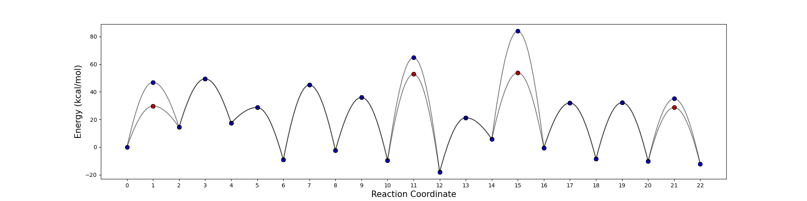

This Python package creates a visual energy diagram  from ground state (GS) and transition state (TS) energies provided in a CSV file. It also allows you to optionally include an existing energy plot PDF in the output.

Usage:

- The script requires a input data file (.csv format)
- The script currently assumes the first column in your CSV file contains state labels and the following columns contain GS and TS energies You can modify the script to match the format of your data file. Example input file given in example driectory. 
- You can choose bettwen a exponential and gaussian spline to connect the transition states to the ground states. 
- Use python energy_plot.py -h to get more information on input arguments.

